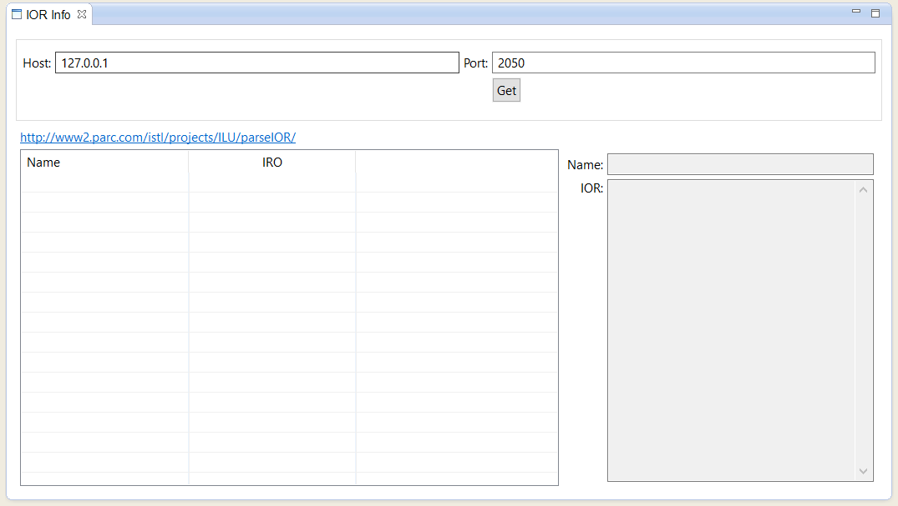

# corba.tools
corba tools for eclipse

##Setup 

Download and unzip the file [org.smark.corba.tools_***.zip](https://github.com/smarkm/corba.tools/releases/download/ver_0.0.1/org.smark.corba.tools_0.0.1.zip) to 'eclipse/dropins' directory.